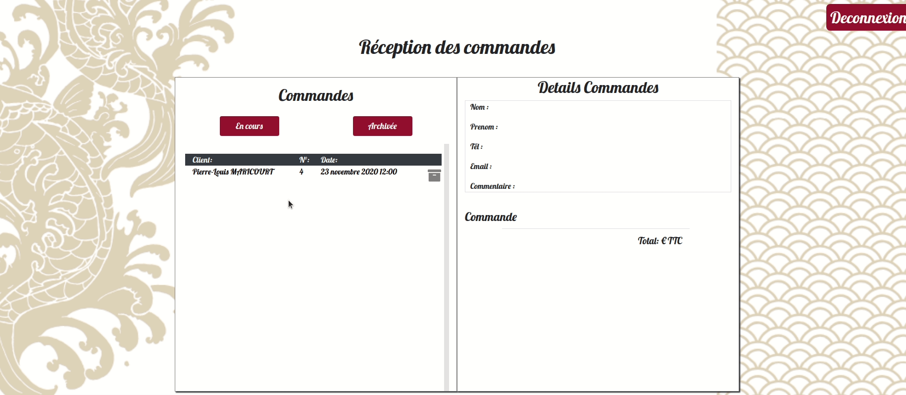

# Projet oMiso
    Projet fictif de fin de formation : O’Miso restaurant de cuisine asiatique souhaite la création d’un site internet lui offrant une visibilité en ligne afin de faire connaître ses produits et mettre à  la disposition de ses clients des services pratiques comme la commande en ligne et le click & collect.
[cahier_des_charges.pdf](./docs/specifications.pdf)
## Aspect visuel

1. Prendre une commande

2. Gestion de la commande (reçu)

3. BackOffice, gestion du personnel, des produits et des commandes pour faire les comptes.

## Aspects Technique

| Backend |FrontEnd |
|--|--|
|Framework : Symfony | Framework : ReactJS|
|Security : [LexikJWTAuthenticationBundle](https://github.com/lexik/LexikJWTAuthenticationBundle)|Security : [jwt-decode](https://www.npmjs.com/package/jwt-decode)|
|Architecture : MVC |"Architecture" : [redux](https://redux.js.org/)|
|Backoffice : [easyAdmin](https://symfony.com/doc/current/bundles/EasyAdminBundle/index.html)||
|Base de donnés : MySQL  -> [oMiso](./dosc/oMiso.sql)||
